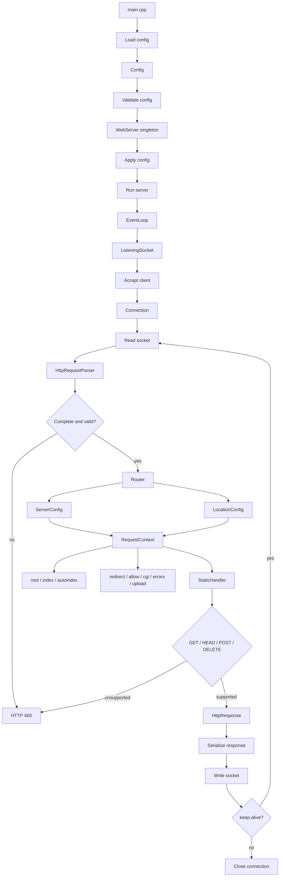
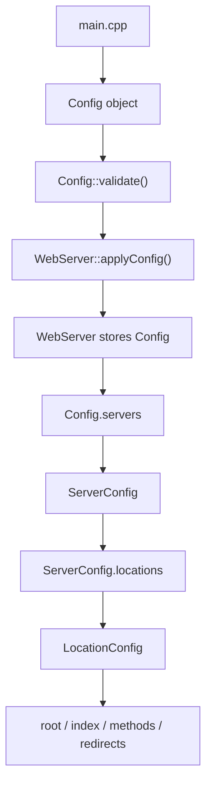
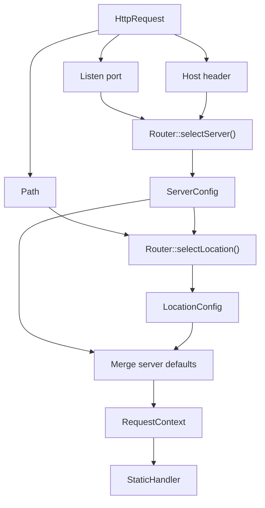
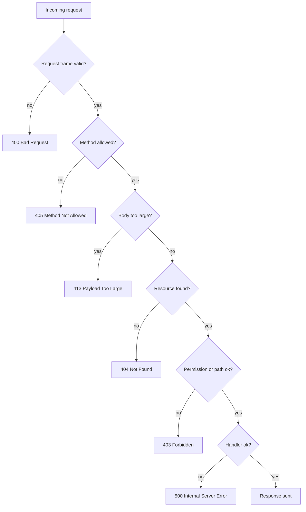

*This project has been created as part of the 42 curriculum by leothoma and tstephan.*

# webserv

`webserv` is a small HTTP server written in C++98 for the 42 curriculum. It parses a JSON configuration file, opens listening sockets, routes requests by host and path, serves static files, and supports common HTTP behaviors such as error pages, uploads, and CGI execution.

## Overview



## Description

The project focuses on building a non-blocking web server from scratch.

Main features:

- HTTP/1.1 request parsing.
- Configurable virtual servers and locations.
- Static file serving.
- Custom error pages.
- Directory indexes and autoindex support.
- File upload handling.
- CGI execution for configured routes.
- Non-blocking I/O with `epoll`.

## Configuration Flow



## Routing Flow



## Error Handling



## Instructions

### Compilation

```bash
make
```

### Execution

```bash
./webserv config.json
```

If no configuration file is provided, the program should use its default configuration behavior, if implemented.

### Example configuration

The repository includes [`config.json`](./config.json) as a working example. It defines:

- a server listening on port `8080`;
- a static root at `./www`;
- a custom `404` page at `/errors/404.html`;
- a CGI-enabled `/cgi-bin` location.

## Resources

- RFC 9110 and RFC 9112 for HTTP semantics and HTTP/1.1.
- `man` pages for system calls used by the project, especially `epoll`, `socket`, `bind`, `listen`, `accept`, `read`, `write`, `poll`, `fcntl`, and `fork`.
- CGI documentation for request environment variables and standard input/output handling.
- The project code and comments for implementation details.

## AI Usage

AI tools were used to help with documentation, code organization, and review of implementation choices. Any generated content should still be validated against the project requirements and the actual behavior of the codebase.

## Repository Layout

- `src/`: source code.
- `include/`: headers.
- `jsons/`: JSON fixtures used by the configuration parser.
- `tests/fixtures/cgi/`: CGI fixture scripts.
- `www/`: static demo site.
- `errors/`: custom error pages.
- `www/uploads/`: upload target directory.

## Demo Assets

The repository ships with minimal demo assets so the default configuration has a valid static root and error page:

- `www/index.html`
- `errors/404.html`
- `www/uploads/.gitkeep`
