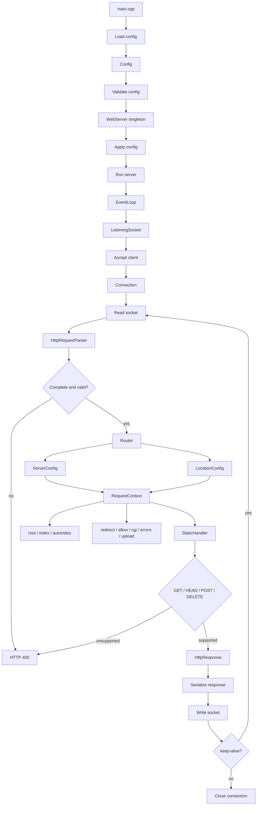
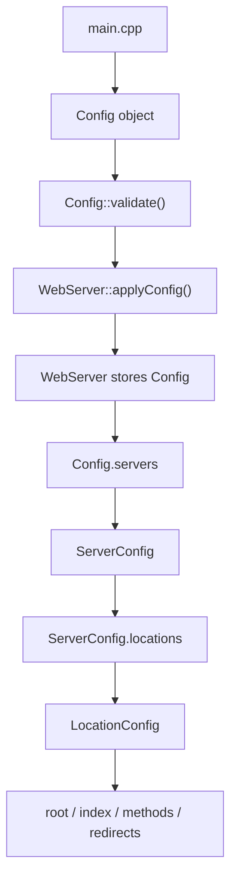
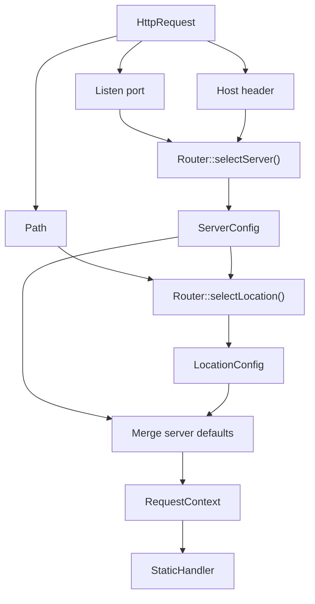
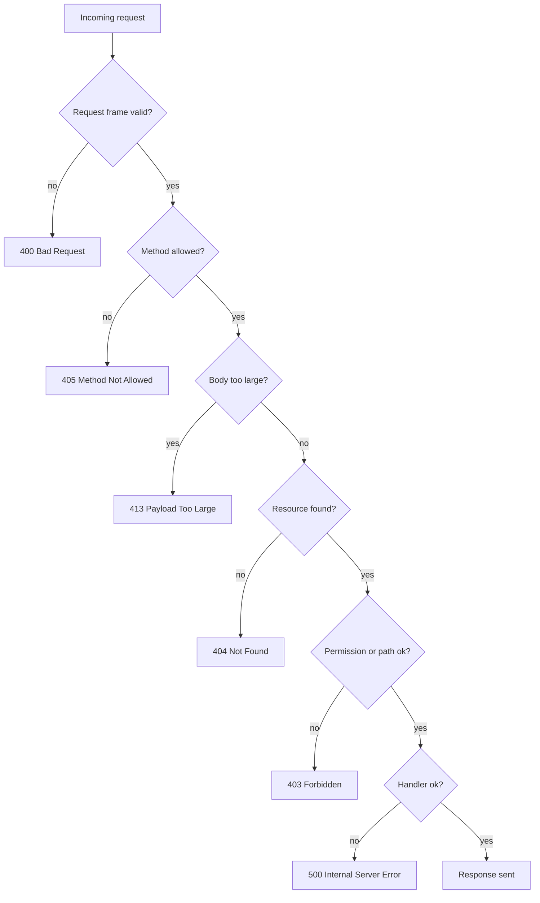

_This project has been created as part of the 42 curriculum by leothoma and tstephan._

# webserv

## Description

`webserv` is a C++98 HTTP server built for the 42 curriculum.
Its goal is to accept client connections, parse HTTP requests, route them according to the loaded configuration, and generate the correct HTTP responses for static files, errors, uploads, and CGI execution.

## Schemas









The project covers the main pieces of a web server:

- configuration parsing;
- virtual hosts and route selection;
- non-blocking socket I/O;
- HTTP request parsing and response serialization;
- static file serving;
- CGI execution for configured routes;
- upload handling and custom error pages.

## Instructions

### Prerequisites

- `make`
- `g++` with C++98 support
- a Linux environment, since the project uses `epoll`

### Compilation

```bash
make
```

Useful targets:

```bash
make clean
make fclean
make re
make cppcheck
make format
```

### Execution

Run the server with a configuration file:

```bash
./webserv config.json
```

The provided [`config.json`](./config.json) starts a server on port `8111` and uses the demo content in:

- [`www/`](./www)
- [`errors/`](./errors)
- [`cgi-bin/`](./cgi-bin)
- [`www/uploads/`](./www/uploads)

You can enable debug logs with:

```bash
WEBSERV_DEBUG=1 ./webserv config.json
```

## Features

- HTTP/1.0 and HTTP/1.1 request handling.
- Configurable server blocks and locations.
- Static file serving with index support.
- Custom error pages.
- CGI execution for configured extensions or routes.
- Upload support for configured directories.
- Non-blocking event-driven I/O.

## Resources

Classic references used for this project:

- [RFC 9110: HTTP Semantics](https://www.rfc-editor.org/rfc/rfc9110)
- [RFC 9112: HTTP/1.1](https://www.rfc-editor.org/rfc/rfc9112)
- [RFC 3875: CGI - Common Gateway Interface](https://www.rfc-editor.org/rfc/rfc3875)
- `man 2 epoll_create`, `man 2 epoll_ctl`, `man 2 epoll_wait`
- `man 2 socket`, `man 2 bind`, `man 2 listen`, `man 2 accept`
- `man 2 read`, `man 2 write`, `man 2 fcntl`, `man 2 fork`, `man 2 execve`
- JSON syntax reference: [RFC 8259](https://www.rfc-editor.org/rfc/rfc8259)

AI usage:

- AI was used to rewrite and structure this README so it matches the 42 rubric.
- AI helped cross-check the documented build and run commands against [`Makefile`](./Makefile) and [`src/main.cpp`](./src/main.cpp).
- AI helped summarize the implementation areas from the repository layout and configuration files.
- AI was not used as an authoritative source for the server implementation; the codebase remains the source of truth.

## Project Layout

- [`src/`](./src): implementation of the server.
- [`include/`](./include): public headers.
- [`config.json`](./config.json): sample configuration.
- [`www/`](./www): demo static content.
- [`errors/`](./errors): custom error pages.
- [`cgi-bin/`](./cgi-bin): CGI scripts used by the demo config.
- [`tests/`](./tests): parser, request, CGI, and upload fixtures.
